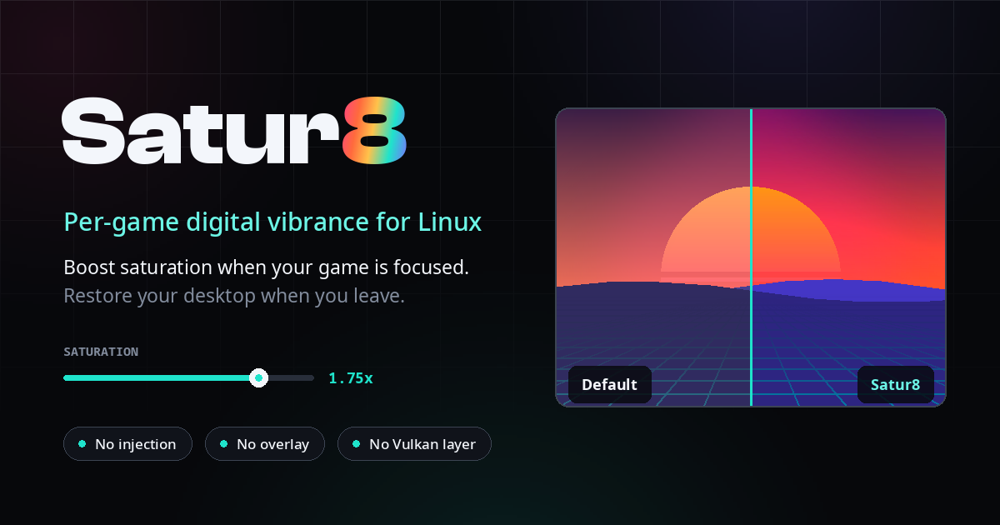
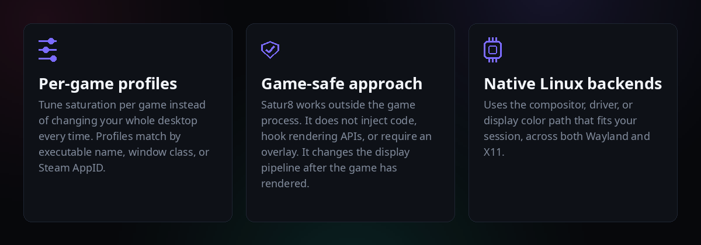
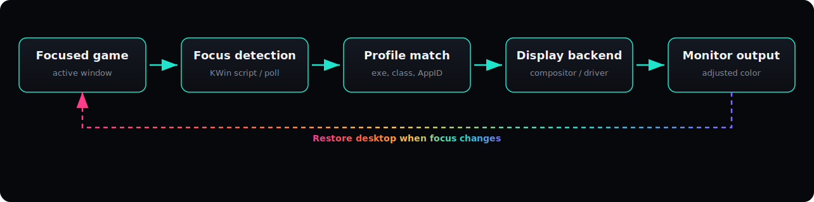
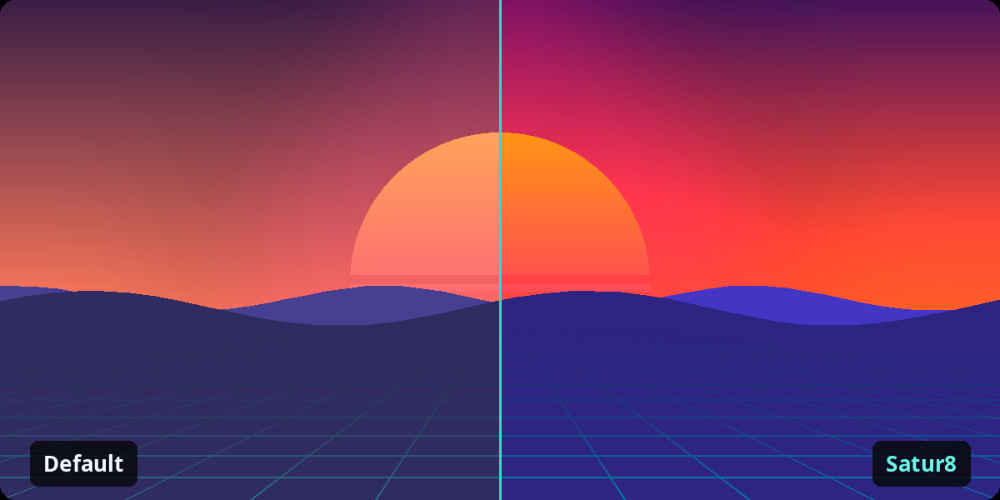
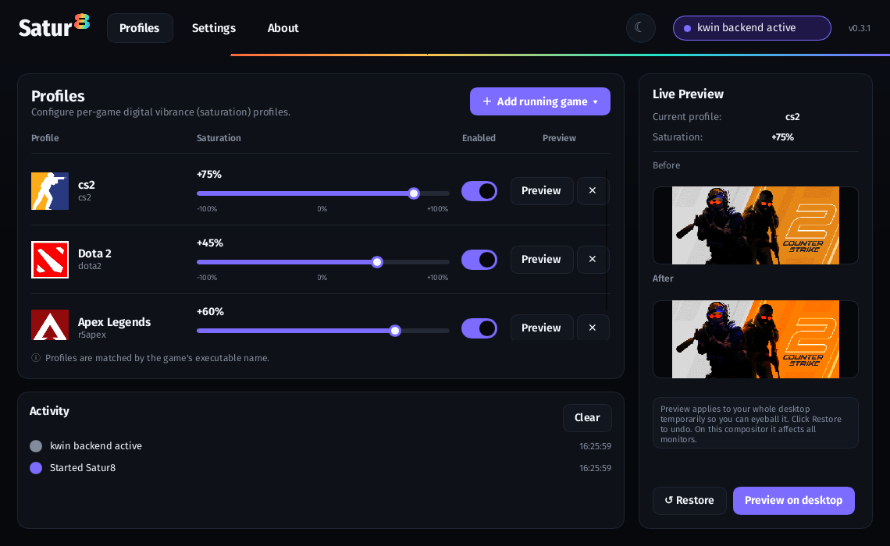
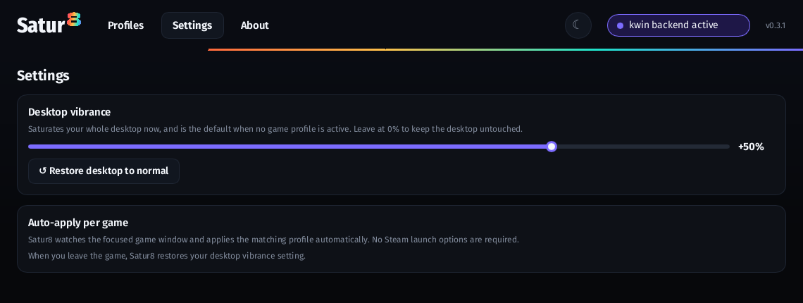

<div align="center">




**Per-game digital vibrance for Linux gaming.**

Boost saturation when your game is focused. Restore your desktop when you leave.  
No game injection. No Vulkan layer. No overlay. Built for modern Linux display stacks.

[Website](https://satur8.app) · [Releases](https://github.com/NtrpyDev/satur8/releases) · [Roadmap](ROADMAP.md) · [Issues](https://github.com/NtrpyDev/satur8/issues) · [Buy Me a Coffee](https://buymeacoffee.com/ntrpydev)


</div>

## What is Satur8?

Satur8 is a Linux app for per-game saturation control.

Create a profile for a game, choose a vibrance level, and Satur8 applies it automatically when the game is focused. When you leave the game, your desktop returns to normal.

It is built for Linux gaming setups that want the punchy color controls common on Windows and NVIDIA, but through Linux-native compositor, driver, and display backends instead of a copied driver panel.

- Per-game saturation profiles
- Automatic focus detection
- Desktop color restore when leaving a game
- GUI and CLI workflows
- Multiple Linux display backends
- No game-process injection
- No overlay or Vulkan layer required

## Demo

Satur8 watches the focused game, applies the matching color profile, and restores your normal desktop colors when you switch away.


## Why Satur8?



## Install

### Fedora (COPR)

The Fedora package is live on [COPR](https://copr.fedorainfracloud.org/coprs/ntrpydev/satur8/), built for Fedora 43 and 44.

```sh
sudo dnf copr enable ntrpydev/satur8
sudo dnf install satur8
```

### Arch

The Arch packaging files live in `packaging/`. Build and install from a checkout:

```sh
cd packaging
makepkg -si
```

This builds Satur8 from source, including the Rust workspace and the KWin effect. The generated `.SRCINFO` is included for AUR publication. AUR publishing is currently waiting for new AUR account registration to reopen, or for an existing AUR maintainer to push the prepared package.

### Release tarball

Download the latest Linux x86_64 release from the [releases page](https://github.com/NtrpyDev/satur8/releases), then run the installer:

```sh
tar -xzf satur8-*-linux-x86_64.tar.gz
cd satur8-*-linux-x86_64
packaging/install.sh
```

For a system-wide KWin effect install:

```sh
packaging/install.sh --system
```

To uninstall a per-user install:

```sh
packaging/install.sh --uninstall
```

If you clone the source repository instead, the same installer builds and installs Satur8 from source.

## Quick start

1. Install Satur8.
2. Start the focus daemon.
3. Open the GUI.
4. Add a game profile and set your saturation.
5. Launch the game.

Satur8 applies the profile when the game is focused and restores your desktop when you switch away.

Start the user daemon:

```sh
systemctl --user enable --now satur8-daemon
```

Open the desktop app:

```sh
satur8-gui
```

Or set saturation directly from the CLI:

```sh
satur8 on 1.75
satur8 off
```

## How it works

Satur8 does not modify the game itself.

Instead, it watches the active window, matches it against your saved profiles, and applies saturation through the best available display backend for your session.



This means the game renders normally. Satur8 changes the final display color pipeline after the frame has already left the game.



The image above is a generated scene shown at normal saturation on the left and Satur8-boosted saturation on the right.

Because Satur8 does not inject into the game process or hook graphics APIs, it avoids the most common anti-cheat risk patterns associated with overlays, DLL injection, or render hooks. This is a description of how Satur8 works, not a promise about what any anti-cheat vendor will allow.

## Backend support

Satur8 chooses the best available backend for your session. Zero per-frame cost paths use hardware or driver display controls. Compositor shader paths are still cheap, but they do work per frame because the compositor shades the final output.

| Environment | Backend | Per-frame cost | Status |
|---|---|---:|---|
| KDE Plasma Wayland | KWin saturation effect | One compositor pass | Verified |
| GNOME Wayland | GNOME Shell shader extension | One compositor pass | Verified |
| X11 with NVIDIA | NV-CONTROL Digital Vibrance | Zero | Verified |
| Hyprland | `hyprctl` shader backend | One compositor pass | Implemented |
| DRM/KMS sessions | DRM CTM | Zero | Implemented |
| gamescope (running compositor) | gamescope-native color atoms | Reuses existing gamescope | Verified |
| Unsupported Wayland | gamescope nested fallback | Extra nested compositor pass | Implemented |

Status legend:

- Verified: tested on real hardware
- Implemented: built and behind environment detection, not yet independently verified

The gamescope-native path drives an already-running gamescope compositor through its Xwayland color atoms, instead of launching a nested gamescope. It is the basis for the planned Steam Deck and Bazzite work in the [roadmap](ROADMAP.md).

## GUI

The screenshots below show the Satur8 GUI.



In the profile editor you can:

- Add a currently running game.
- Set the saturation level per game.
- Enable or disable a profile.
- Preview a profile on the desktop.
- See the active backend and recent activity.



Settings cover the default desktop vibrance, the manual restore action, and the auto-apply behavior. Profiles auto-save the moment you change them. The GUI also ships dark and bright themes and an in-app About page with project links.

Configuration is stored at:

```sh
~/.config/satur8/profiles.toml   # game profiles
~/.config/satur8/gui.toml        # GUI settings such as theme
```

## CLI

Satur8 includes a CLI for scripting, profiles, and debugging.

```sh
satur8 --help
```

Set or clear saturation now:

```sh
satur8 on 1.75      # turn on at 1.75x (1.0 = unchanged, 0 = greyscale)
satur8 off          # restore normal color
satur8 set 2.0      # set an exact value
```

Inspect the environment and backend:

```sh
satur8 status       # environment, chosen backend, and current state
satur8 doctor       # diagnose backend availability
satur8 outputs      # list the outputs the active backend can target
```

Manage per-game profiles:

```sh
satur8 profile add cs2 1.75 --exe cs2 --steam-app-id 730
satur8 profile list
satur8 profile show cs2
satur8 profile remove cs2
satur8 profile path
```

A profile needs at least one match rule: `--exe`, `--window-class`, or `--steam-app-id`.

### Auto-apply per game

Satur8 has two ways to apply profiles automatically.

**Focus daemon.** The normal KDE path. The KWin focus script forwards active-window changes to the daemon, which matches the focused game and applies its saturation.

```sh
systemctl --user enable --now satur8-daemon
kwriteconfig6 --file kwinrc --group Plugins --key satur8-focusEnabled true
qdbus6 org.kde.KWin /KWin reconfigure
```

**Launch wrapper.** Useful for non-KDE sessions or manual workflows. Apply a profile, launch the game, and restore on exit. This works as a Steam launch option:

```sh
satur8 run --profile cs2 -- %command%
```

For sessions without a native backend, the gamescope strategies are available:

```sh
satur8 run --via gamescope-native -- %command%   # drive a running gamescope
satur8 run --via gamescope -- %command%          # nested gamescope fallback
```

## Development

Satur8 is a Rust workspace. The control tools (CLI, daemon, tray, GUI, backends) are Rust; the KWin effect itself is C++ because KWin effects are Qt/KWin plugins.

Build everything:

```sh
cargo build --release
```

Build only the GUI:

```sh
cargo build -p satur8-gui
```

Run the workspace checks:

```sh
cargo check
cargo test --workspace --locked
```

Capture GUI screenshots off-screen (used for these README images):

```sh
bash assets/gui-shot.sh /tmp/satur8-profiles.png 0
SATUR8_GUI_DARK=1 bash assets/gui-shot.sh /tmp/satur8-settings.png 1
```

Regenerate the rest of the README visuals:

```sh
python3 scripts/generate-readme-assets.py
```

Build the release and source archives:

```sh
packaging/release-tarball.sh
packaging/source-tarball.sh
```

### Repo layout

```text
.
|-- Cargo.toml                     Workspace and shared dependency versions
|-- Cargo.lock                     Pinned dependency versions
|-- README.md                      This file
|-- ROADMAP.md                     What ships next and in what order
|-- PLAN.md                        Design notes and backend architecture
|-- CHANGELOG.md                   Release notes, newest first
|-- AGENTS.md                      Working notes for AI/code agents on this repo
|-- LICENSE                        GPL-3.0-or-later
|-- .gitignore                     Ignored build and packaging artifacts
|-- .copr/                         COPR build entry point (Makefile) for Fedora
|-- .github/
|   `-- workflows/                 Tagged-release CI (source and Linux tarballs)
|-- packaging/                     Installer, Arch PKGBUILD, Fedora spec, release scripts
|-- assets/                        KWin effect and script, GNOME extension, gamescope shader
|   `-- readme/                    Generated README visuals (hero, demo, diagrams)
|-- scripts/                       README asset generator and bundled wordmark font
`-- crates/
    |-- satur8-core/               Shared saturation math and profile model
    |-- satur8-cli/                `satur8` command-line app
    |-- satur8-gui/                Slint desktop GUI
    |-- satur8-daemon/             Focus daemon and profile auto-apply
    |-- satur8-tray/               StatusNotifier tray app
    `-- backends/                  kwin, gnome-shell, hyprland, nv-control, drm-ctm, gamescope
```

## Roadmap

See [ROADMAP.md](ROADMAP.md) for what ships next, including gamescope backend verification and Steam Deck and Bazzite support. Distribution status and open packaging work are tracked there and in the [open issues](https://github.com/NtrpyDev/satur8/issues).

## Contributing

Issues and pull requests are welcome.

Before opening a pull request, please make sure the workspace builds (`cargo build`), the checks pass (`cargo check` and `cargo test --workspace --locked`), and any README commands you touched are still accurate.

## Support

Satur8 is free and open source. If it makes your games look better, you can support development at [Buy Me a Coffee](https://buymeacoffee.com/ntrpydev).

## License

GPL-3.0-or-later. See [LICENSE](LICENSE).
